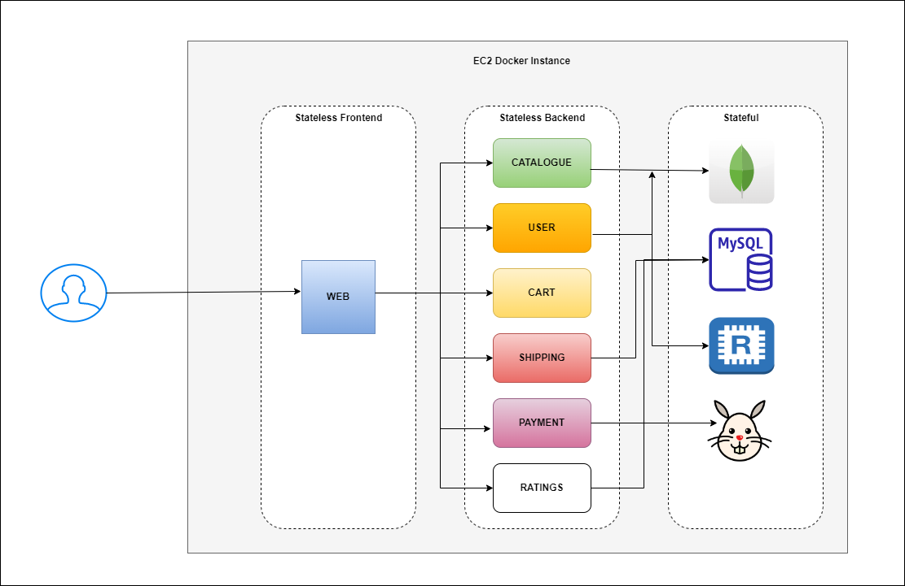

version: "3.9"
services:
  mongodb:
    image: naveenreddy369/mongodb:v1
    container_name: mongodb
  catalogue:
    image: naveenreddy369/catalogue:v1
    container_name: catalogue
    depends_on:
      - mongodb
  web:
    image: naveenreddy369/web:v1
    container_name: web
    ports:
      - "80:80"
    depends_on:
      - catalogue
      - user
      - cart
      - mysql
      - shipping
  redis:
    image: redis
  user:
    image: naveenreddy369/user:v1
    container_name: user
    depends_on:
      - mongodb
      - redis
  cart:
    image: naveenreddy369/cart:v1
    container_name: cart
    depends_on:
      - redis
      - catalogue
  mysql:
    image: naveenreddy369/mysql:v1
    container_name: mysql
  shipping:
    image: naveenreddy369/shipping:v1
    container_name: shipping
    depends_on:
      - mysql
  rabbitmq:
    image: rabbitmq
    container_name: rabbitmq
  payment:
    image: naveenreddy369/payment:v1
    container_name: payment
    depends_on:
      - rabbitmq
  ratings:
    image: naveenreddy369/ratings:v1
    container_name: ratings
    depends_on:
      - mysql
networks:
  roboshop:
    driver: bridge# Below code will download the images from the dockerhub and create the containers.
# docker-compose.yaml

#----------------------------------------------------------------------------------------------------------------------------------------------------------------
### Roboshop using Docker

Roboshop is a sample popular Microservices application. It is owned by Instana which is acquired by IBM. They use this project in their product developments like instana APM tool and other products. It has all the services used for an ideal ecommerce company.

We are going to create Docker images for every service and deploy them as Docker containers in EC2 instance.

#### Steps:
* Clone this project.
```
git clone https://github.com/techworldwithsiva/roboshop.git
```
* Build the images for each service.
```
cd roboshop
```
```
for i in web mongodb catalogue  user cart mysql shipping ratings payment; do cd $i ; docker build -t $i:v1 . ; cd .. ; done
```
* Make sure folders are created for Docker volumes.
```
cd /home/ec2-user
```
```
mkdir mysql
```
```
mkdir rabbitmq
```
```
mkdir redis
```
```
mkdir mongodb
```
* Run docker compose file
```
docker-compose up -d
```


